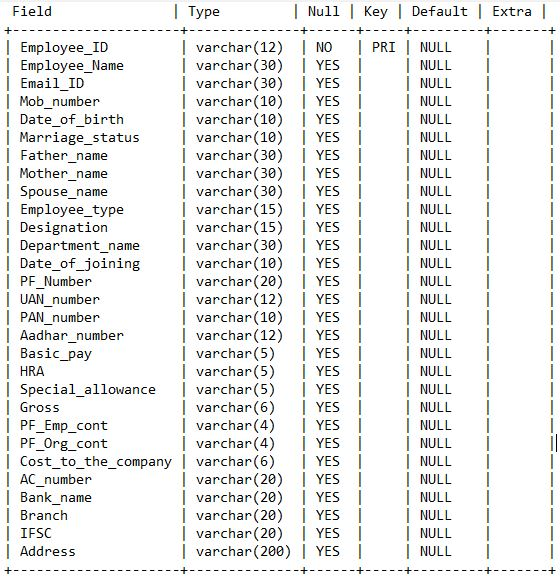

# HR-Management-System-with-Employee-Self-Service-Portal
An integrated HR platform that streamlines HR processes from employee enrollment to payroll, attendance, and leave management. Features an employee self-service portal that allows employees to clock-in/clock-out, apply for leave, and view their attendance records.

